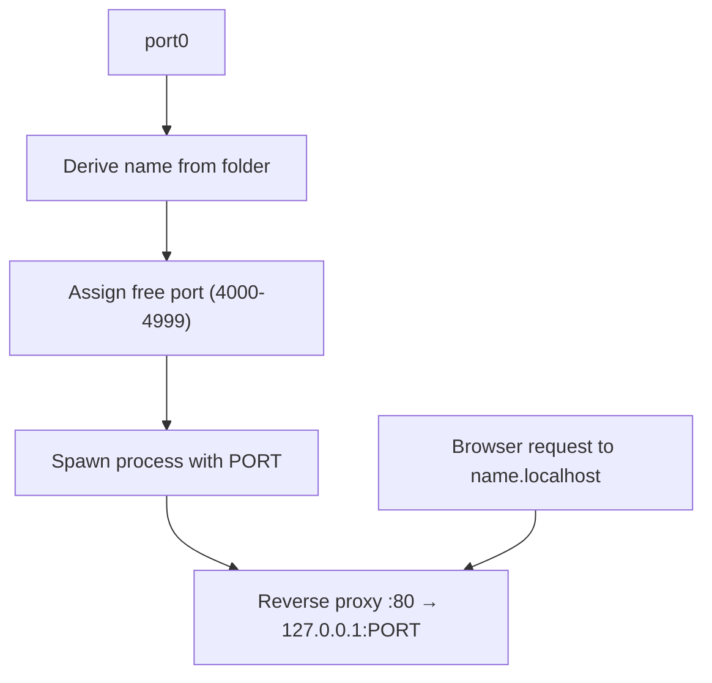

# port0

No ports. Just names.

port0 auto-assigns a free port, injects `PORT` into your process, and reverse-proxies HTTP(S) traffic on port 80 to a human-friendly hostname (for example: `project.localhost`). Zero-config if you use `.localhost` (recommended).

---

## Quick install

Build from source (recommended):
```bash
git clone https://github.com/Blu3Ph4ntom/port0.git
cd port0
go build -o port0 .
# optional: install system-wide
sudo mv port0 /usr/local/bin/port0
```

One-line convenience installer (downloads release binary):
```bash
# macOS / Linux
curl -fsSL https://raw.githubusercontent.com/Blu3Ph4ntom/port0/main/install.sh | bash

# Windows (PowerShell)
irm https://raw.githubusercontent.com/Blu3Ph4ntom/port0/main/install.bat | iex
```

---

## Quick start

Run any dev command; port0 injects `PORT` and exposes the service at three TLDs:
```bash
cd ~/projects/myapp
port0 npm run dev
# or
port0 go run ./cmd/server
```

Primary URL (recommended): `http://myapp.localhost`  
Alternatives: `http://myapp.web`, `http://myapp.local`

---

## How it works (simple diagram)



---

## One-time setup (only if you want `.web` / `.local`)

`.localhost` works without setup. Setup is required only to enable `.web` and `.local` resolution and to allow binding privileged ports.

- macOS
  - Run: `sudo port0 setup`
  - Installs `/etc/resolver/web` and `/etc/resolver/local` and a LaunchDaemon.

- Linux (systemd)
  - Run: `sudo port0 setup`
  - Writes systemd-resolved config, sets CAP_NET_BIND_SERVICE, installs a user service.

- Windows
  - Open Administrator PowerShell and run: `port0 setup`
  - Adds firewall rules and NRPT rules (Add-DnsClientNrptRule) for `.web` and `.local`.

Remove system configuration:
```bash
sudo port0 teardown
# Windows: run teardown in Administrator PowerShell
```

---

## Usage (common commands)

- `port0 <cmd...>` — run command with PORT injection (default)
- `port0 -n <name> <cmd...>` — set custom name
- `port0 -d <cmd...>` — run detached/background
- `port0 ls` — list projects
- `port0 logs <name>` — show logs (`-f` to follow)
- `port0 kill <name>` — stop project
- `port0 link <name> <port>` — link an existing server to a name
- `port0 setup` / `port0 teardown` — system config
- `port0 update` — download & replace with latest release binary
- `port0 daemon start|stop|status` — manage daemon

---

## Integration note

port0 only injects the `PORT` environment variable. Ensure your app reads it:
- Node: `process.env.PORT`
- Go: `os.Getenv("PORT")`
- Python: `os.environ.get("PORT")`
- Rust: `env::var("PORT")`

For monorepos, use `-n` to choose distinct names (e.g. `port0 -n api ...`).

---

## Update & releases

- `port0 update` — downloads the latest release binary and replaces the current executable (may require sudo if installed system-wide).
- To build and publish releases: tag and push (e.g. `git tag v0.1.0 && git push origin v0.1.0`) and run your release CI.

---

## Troubleshooting (short)

- "daemon not running": run `port0 daemon start`.
- DNS `.web`/`.local` not resolving:
  - Windows: `Get-DnsClientNrptRule` in Admin PowerShell.
  - macOS: check `/etc/resolver/web` and `/etc/resolver/local`.
  - Linux: check `/etc/systemd/resolved.conf.d/port0.conf` and `resolvectl`.
- Permission denied binding port 80: run `port0 setup` (grants capability or configures daemon).

---

## Files & examples

- Examples are in `examples/` for quick testing but are not required for normal usage.
- Prefer building from source for reproducibility.

---

## License

MIT