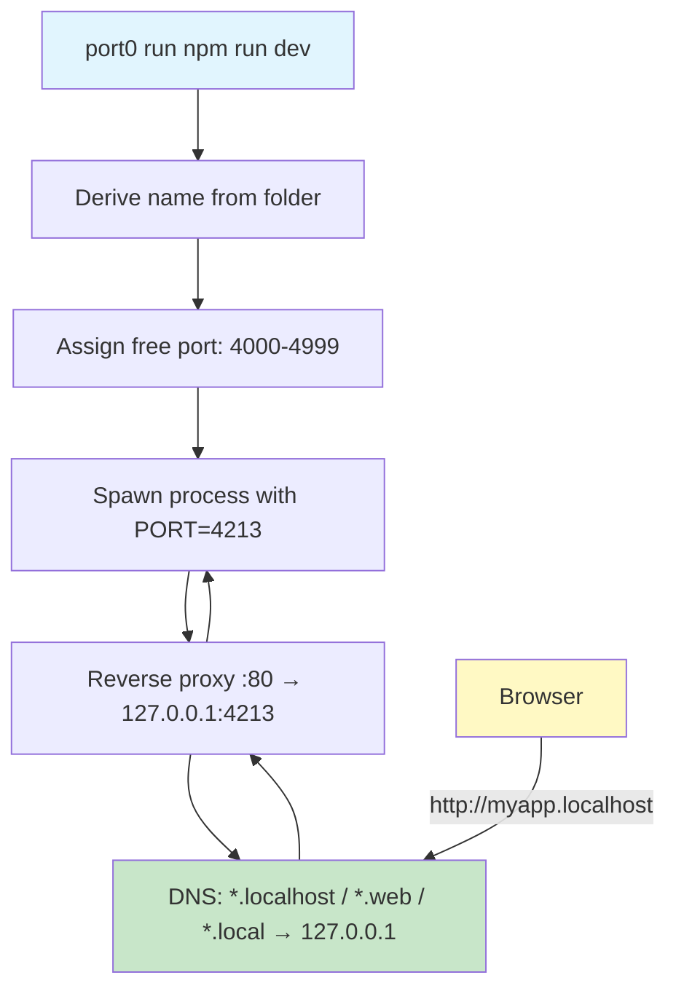
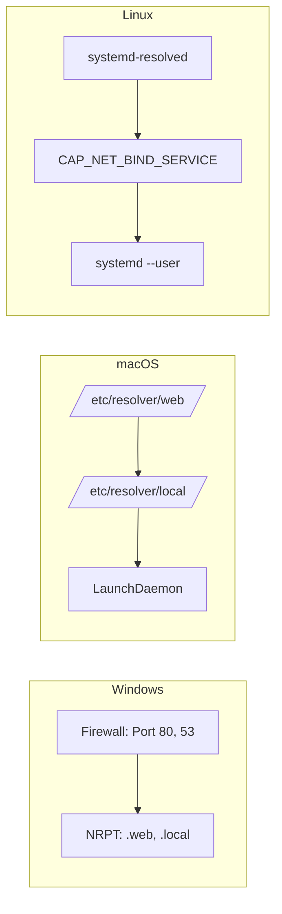
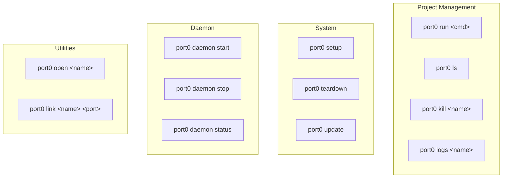
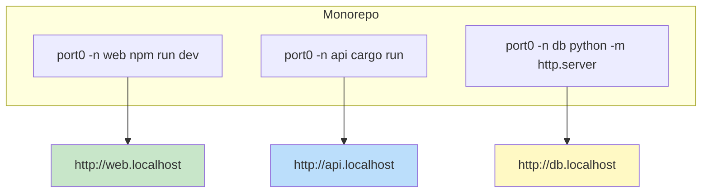
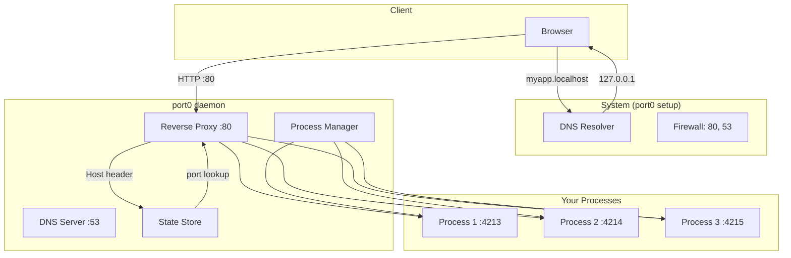

# port0

### No ports. Just names.

Auto-assigns ports, injects `PORT` env var, reverse-proxies to human-readable hostnames.

```mermaid
┌─────────────────────────────────────────────────────────────────────────────┐
│                              YOUR WORKFLOW                                   │
├─────────────────────────────────────────────────────────────────────────────┤
│                                                                             │
│   $ cd ~/projects/myapp                                                     │
│   $ port0 npm run dev                                                       │
│                                                                             │
│   ┌─────────────────────────────────────────────────────────────────────┐   │
│   │  port0: myapp → http://myapp.localhost (port 4213)                  │   │
│   │    also: http://myapp.web, http://myapp.local                       │   │
│   └─────────────────────────────────────────────────────────────────────┘   │
│                                                                             │
└─────────────────────────────────────────────────────────────────────────────┘
```

## How It Works



## Installation

### macOS / Linux

```bash
# One-line install
curl -fsSL https://raw.githubusercontent.com/blu3ph4ntom/port0/main/install.sh | bash
```

**What it does:**
1. Detects your OS (darwin/linux) and architecture (amd64/arm64)
2. Downloads the latest binary from GitHub releases
3. Installs to `/usr/local/bin/port0` (may prompt for sudo)

### Windows (PowerShell)

```powershell
# One-line install
irm https://raw.githubusercontent.com/blu3ph4ntom/port0/main/install.bat | iex
```

**What it does:**
1. Downloads the latest `port0.exe` from GitHub releases
2. Installs to `%USERPROFILE%\bin\port0.exe`
3. Prompts you to add the directory to PATH

### Manual Installation

Download from [GitHub Releases](https://github.com/blu3ph4ntom/port0/releases):

| OS | Arch | Download |
|----|------|----------|
| macOS | Intel | `port0-darwin-amd64` |
| macOS | Apple Silicon | `port0-darwin-arm64` |
| Linux | x86_64 | `port0-linux-amd64` |
| Linux | ARM64 | `port0-linux-arm64` |
| Windows | x86_64 | `port0-windows-amd64.exe` |

```bash
# macOS/Linux
chmod +x port0-*
sudo mv port0-* /usr/local/bin/port0

# Windows: Add to PATH manually
```

## Setup (One-Time)



### Windows Setup

**Requirements:** Administrator access

```powershell
# Run PowerShell as Administrator
port0 setup
```

**What it configures:**

| Step | Command | Purpose |
|------|---------|---------|
| 1 | `netsh advfirewall ...` | Allow inbound traffic on port 80 (HTTP proxy) |
| 2 | `netsh advfirewall ...` | Allow inbound traffic on port 53 (DNS server) |
| 3 | `Add-DnsClientNrptRule -Namespace ".web"` | Resolve *.web → 127.0.0.1 |
| 4 | `Add-DnsClientNrptRule -Namespace ".local"` | Resolve *.local → 127.0.0.1 |

**After setup:**
```
✓ Firewall rule added for port 80
✓ Firewall rule added for port 53
✓ NRPT rule added for .web → 127.0.0.1
✓ NRPT rule added for .local → 127.0.0.1
```

**To remove:**
```powershell
# Run as Administrator
port0 teardown
```

### macOS Setup

**Requirements:** sudo access

```bash
sudo port0 setup
```

**What it configures:**

| Step | Path | Purpose |
|------|------|---------|
| 1 | `/etc/resolver/web` | Resolver for *.web → 127.0.0.1 |
| 2 | `/etc/resolver/local` | Resolver for *.local → 127.0.0.1 |
| 3 | `/Library/LaunchDaemons/com.port0.daemon.plist` | Auto-start daemon |

**After setup:**
```
✓ Created /etc/resolver
✓ Resolver created for .web → 127.0.0.1
✓ Resolver created for .local → 127.0.0.1
✓ LaunchDaemon plist written
```

**Start the daemon:**
```bash
sudo launchctl load /Library/LaunchDaemons/com.port0.daemon.plist
```

**To remove:**
```bash
sudo port0 teardown
```

### Linux Setup

**Requirements:** sudo access, systemd

```bash
sudo port0 setup
```

**What it configures:**

| Step | Path/Command | Purpose |
|------|--------------|---------|
| 1 | `/etc/systemd/resolved.conf.d/port0.conf` | DNS for *.web, *.local |
| 2 | `systemctl restart systemd-resolved` | Apply DNS config |
| 3 | `setcap cap_net_bind_service=+ep` | Allow binding port 80 without root |
| 4 | `~/.config/systemd/user/port0.service` | User service for daemon |

**After setup:**
```
✓ Created /etc/systemd/resolved.conf.d
✓ DNS config written for .web and .local → 127.0.0.1
✓ systemd-resolved restarted
✓ CAP_NET_BIND_SERVICE set
✓ Systemd service written
```

**Start the daemon:**
```bash
systemctl --user start port0
```

**To remove:**
```bash
sudo port0 teardown
```

## TLD Options

| TLD | Status | How It Works |
|-----|--------|--------------|
| `.localhost` | **STABLE** | Native browser support via [RFC 6761](https://datatracker.ietf.org/doc/html/rfc6761). Works in Chrome, Firefox, Edge, Safari. Zero setup. |
| `.web` | ✅ Ready | NRPT (Windows) or `/etc/resolver` (macOS) or systemd-resolved (Linux) |
| `.local` | ✅ Ready | Same DNS configuration as `.web` |

**Recommendation:** Use `.localhost` for maximum compatibility.

## Quick Start

```bash
# One-time setup (see above for your OS)
sudo port0 setup

# Run your dev server
port0 npm run dev
port0 python -m http.server
port0 go run main.go
port0 cargo run
port0 php -S localhost:0
```

Output:
```
port0: myapp → http://myapp.localhost (port 4213)
  also: http://myapp.web, http://myapp.local
```

## Commands



| Command | Description |
|---------|-------------|
| `port0 <cmd...>` | Run a command with PORT injection (default) |
| `port0 ls` | List all projects |
| `port0 logs <name>` | View project logs (`-f` to follow) |
| `port0 kill <name>` | Stop a project |
| `port0 open <name>` | Open project URL in browser |
| `port0 link <name> <port>` | Link an existing server to a name |
| `port0 setup` | Configure system (firewall, DNS, daemon) |
| `port0 teardown` | Remove system configuration |
| `port0 update` | Update to latest version |
| `port0 daemon start` | Start the background daemon |
| `port0 daemon stop` | Stop the daemon |
| `port0 daemon status` | Show daemon status |

## Flags

```bash
port0 [flags] <command...>

Flags:
  -n, --name <string>      Project name (default: folder name)
  -d, --detach             Run in background
      --port-range <range> Port range (default: 4000-4999)
      --tls                Enable HTTPS with self-signed cert
      --restart <policy>   Restart policy: no, always, on-failure
      --json               JSON output for scripting
  -v, --version            Show version
  -h, --help               Show help
```

## Integration

### Node.js / npm

**package.json:**
```json
{
  "scripts": {
    "dev": "port0 vite",
    "start": "port0 node server.js",
    "serve": "port0 -d npm run start"
  }
}
```

**Any server:**
```bash
# Vite
port0 vite

# Next.js
port0 next dev

# Create React App
port0 npm start

# Express
port0 node server.js
```

### Python

**requirements.txt** (optional, for documentation):
```
# Run with: port0 python -m http.server
# Or: port0 python app.py
```

**Flask:**
```python
# app.py
import os
from flask import Flask

app = Flask(__name__)

if __name__ == '__main__':
    port = int(os.environ.get('PORT', 5000))
    app.run(host='0.0.0.0', port=port)
```

```bash
port0 python app.py
```

**FastAPI:**
```bash
port0 uvicorn main:app --host 0.0.0.0 --port $PORT
```

**Django:**
```bash
port0 python manage.py runserver 0.0.0.0:$PORT
```

### Go

```go
package main

import (
    "fmt"
    "net/http"
    "os"
)

func main() {
    port := os.Getenv("PORT")
    if port == "" {
        port = "8080"
    }
    
    http.HandleFunc("/", func(w http.ResponseWriter, r *http.Request) {
        fmt.Fprintf(w, "Hello from port %s", port)
    })
    
    fmt.Printf("Server listening on port %s\n", port)
    http.ListenAndServe(":"+port, nil)
}
```

```bash
port0 go run main.go
```

### Rust

```bash
# Cargo.toml - ensure your server reads PORT env
port0 cargo run
```

**Actix-web example:**
```rust
use actix_web::{App, HttpServer, get, HttpResponse};
use std::env;

#[get("/")]
async fn index() -> HttpResponse {
    HttpResponse::Ok().body("Hello World")
}

#[actix_web::main]
async fn main() -> std::io::Result<()> {
    let port = env::var("PORT").unwrap_or_else(|_| "8080".to_string());
    
    HttpServer::new(|| App::new().service(index))
        .bind(format!("0.0.0.0:{}", port))?
        .run()
        .await
}
```

### Ruby

```ruby
# server.rb
require 'webrick'

port = ENV['PORT'] || 3000
server = WEBrick::HTTPServer.new(Port: port, BindAddress: '0.0.0.0')

trap('INT') { server.shutdown }
server.start
```

```bash
port0 ruby server.rb
```

### PHP

```bash
port0 php -S 0.0.0.0:$PORT
```

### Deno

```bash
port0 deno run --allow-net --allow-env server.ts
```

### Bun

```bash
port0 bun run dev
```

## Monorepo Example



```bash
# Terminal 1
cd ~/monorepo/apps/web
port0 -n web npm run dev
# → http://web.localhost

# Terminal 2
cd ~/monorepo/apps/api
port0 -n api cargo run
# → http://api.localhost

# Terminal 3
cd ~/monorepo/apps/docs
port0 -n docs python -m http.server
# → http://docs.localhost
```

## Architecture



## Troubleshooting

### "port0 daemon not running"

```bash
# Start the daemon
port0 daemon start

# Or re-run setup
sudo port0 setup
```

### "port already in use"

```bash
# Use a different port range
port0 --port-range 5000-5999 npm run dev
```

### "process may not honor PORT env var"

Your app started but didn't bind to the assigned port. Ensure your application reads the `PORT` environment variable:

| Language | Code |
|----------|------|
| Node.js | `process.env.PORT` |
| Python | `os.environ.get('PORT')` |
| Go | `os.Getenv("PORT")` |
| Rust | `env::var("PORT")` |
| Ruby | `ENV['PORT']` |
| PHP | `getenv('PORT')` |

### "permission denied" on port 80

```bash
# Run setup to configure capabilities
sudo port0 setup
```

### DNS not resolving .web or .local

**Windows:**
```powershell
# Verify NRPT rules
Get-DnsClientNrptRule

# If missing, re-run setup as Administrator
port0 setup
```

**macOS:**
```bash
# Check resolver files
cat /etc/resolver/web
cat /etc/resolver/local

# Should show:
# nameserver 127.0.0.1
# port 53
```

**Linux:**
```bash
# Check resolved config
cat /etc/systemd/resolved.conf.d/port0.conf

# Test resolution
resolvectl query myapp.web
```

## How `link` Works

The `link` command lets you connect an already-running server to a hostname:

```bash
# You have a server running on port 3000
# Link it to a name:
port0 link myapp 3000

# Now accessible at:
# http://myapp.localhost
# http://myapp.web
# http://myapp.local
```

## Update

```bash
# Update to the latest version
port0 update

# On macOS/Linux, may need sudo if installed to /usr/local/bin
sudo port0 update
```

## Uninstall

```bash
# Remove system configuration
sudo port0 teardown

# Remove binary
# macOS/Linux:
sudo rm /usr/local/bin/port0

# Windows:
del %USERPROFILE%\bin\port0.exe
```

## Requirements

- **Ports 80 and 53** must be available (configured via setup)
- Your application must **honor the `PORT` environment variable**
- **Administrator/sudo access** for setup (one-time)

## License

MIT